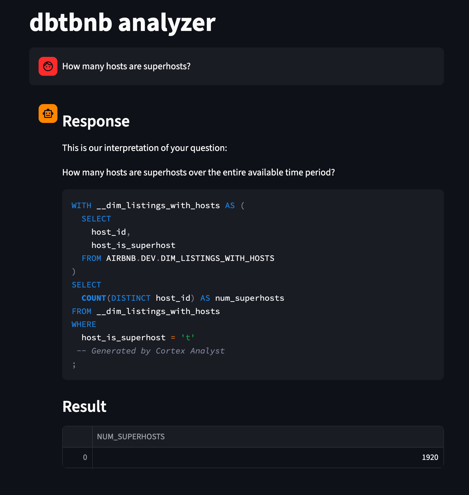

# dbtbnb

Learning DBT by transforming Airbnb data.

## About

This repository implements data pipelines via dbt outlined in the [dbt bootcamp][6] course, but it does not stop there. It also includes Terraform code to deploy and configure the required Snowflake resources, a Streamlit app to analyze Airbnb data via Snowflake [Cortex Analyst][7] and helper tasks to make it easy to get started.

Here is screenshot of the Streamlit app:

## Prerequisites

- [uv][1]
- [Task][2]
- [Terraform][3]
- [Snowflake][4] account
- [Snowsql][5] connected to Snowflake account
- [jq][11] to make tasks dealing with JSON data work
- Optional: [Preset][8] account to build a dashboard

## Installation

1. Make sure you meet the prerequisites
1. Setup the development environment: `task setup`
1. Create SSH key pairs for Snowflake users: `task sf:create-user-keypairs`
1. Adapt the **terraform.tfvars** file as described in the configuration section
1. Create the Terraform service user in Snowflake: `task sf:create-tf-user`
1. Create the required Snowflake resources: `task tf:apply`
1. Copy the raw data used in the course to Snowflake: `task sf:copy-raw-data`
1. Adapt the **profiles.yml** file as described in the configuration section
1. Adapt the **.env** file as described in the configuration section

## Configuration

### Infrastructure

Edit **terraform.tfvars** file int the __infra__ directory and set the following variables:

| Variable | Description | Note |
| --- | --- | --- |
| sf_org | Snowflake organization
| sf_account | Snowflake account identifier
| sf_user | Name of Snowflake Terraform user
| sf_private_key_path | Path to the private key of the Snowflake Terraform user
| sf_public_key_path | Path to the public key of the Snowflake Terraform user
| dbt_private_key_path | Path to the private key of the Snowflake dbt user
| dbt_public_key_path | Path to the public key of the Snowflake dbt user
| preset_private_key_path | Path to the private key of the Snowflake preset user
| preset_public_key_path | Path to the public key of the Snowflake preset user
| streamlit_private_key_path | Path to the private key of the Snowflake Streamlit user
| streamlit_public_key_path | Path to the public key of the Snowflake Streamlit user

### Analytics

Edit the **profiles.yml** file int he __analytics__ directory and provide actual values for the placeholders __SNOWFLAKE_ACCOUNT_NAME__ and __FULL_PATH_TO_YOUR_PRIVATE_KEY__

### Application

Edit the **.env** file in project __root__ directory and set the following variables:

| Variable | Description | Note |
| --- | --- | --- |
| SF_ORG | Snowflake organization
| SF_ACCOUNT | Snowflake account identifier
| SF_USER | Name of Snowflake Streamlit user
| SF_PRIVATE_KEY_FILE_PATH | Path to the private key of the Snowflake Streamlit user
| SF_ROLE | Role used by the Snowflake Streamlit user | Defaults to 'AGENT'
| SF_WAREHOUSE | Warehouse used by the Snowflake Streamlit user | Defaults to 'COMPUTE_WH'
| SF_DATABASE | Snowflake database
| SF_SCHEMA | Snowflake schema
| SF_SEMANTIC_VIEW | Fully qualified name of the semantic view for Cortex Analyst
| LOG_LEVEL | Set the logging level | Defaults to 'INFO'

## Usage

### Running pipelines

1. Run pipelines: `task dbt:run`

### Connecting to preset

1. Get the Snowflake connection string: `task preset:get-connection-string`
1. Get the auth snippet: `task preset:get-auth-snippet`

### Running the UI locally

1. Start the UI via `task dev:start-ui`

## Limitations

### Creation of semantic view for Cortex Analyst

Creation of [semantic views][9] required to analyze data by Snowflake Cortex Analyst is not yet automated. Follow the [documentation][10] to create a view via the UI instead.

### Running Streamlit app in Snowflake (SiS)

Running the Streamlit app in Snowflake is not yet implemented.

## Troubleshooting

Terraform might not apply all of the required permissions in Snowflake reliably. If you encounter errors, turn to Snowflake directly to fix them.

## Contributing

Check out [Contributing](Contributing.md) for further information.

[1]: https://docs.astral.sh/uv/
[2]: https://taskfile.dev/
[3]: https://developer.hashicorp.com/terraform
[4]: https://www.snowflake.com/
[5]: https://docs.snowflake.com/en/user-guide/snowsql
[6]: https://www.udemy.com/course/complete-dbt-data-build-tool-bootcamp-zero-to-hero-learn-dbt
[7]: https://docs.snowflake.com/user-guide/snowflake-cortex/cortex-analyst#overview
[8]: https://preset.io/
[9]: https://docs.snowflake.com/en/user-guide/views-semantic/overview
[10]: https://docs.snowflake.com/en/user-guide/views-semantic/ui
[11]: https://jqlang.org/
